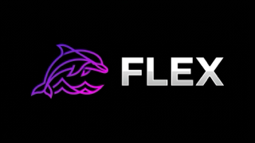

<p align="center">
  
</p>

<h1 align="center">Flex — An OSS Android TV Client for Jellyfin</h1>
<p align="center"><strong><em>Stream Like a King</em></strong></p>

<p align="center">
  <a href="https://github.com/kasundsilva/flex/releases/latest">
    
  </a>
  <a href="https://github.com/kasundsilva/flex/actions/workflows/build-flex.yml">
    
  </a>
  <a href="LICENSE">
    
  </a>
</p>

---

**Flex** is an open-source Android TV / Google TV client for Jellyfin. It delivers a fast, modern media experience with a Plex-inspired user interface, native media playback, and automated release tracking synchronized with upstream [Wholphin](https://github.com/damontecres/Wholphin).

---

## Features

### User Interface
- **Fully Customizable Home Screen:** Re-order rows, use poster or thumb thumbnails, combine *Continue Watching* and *Next Up*, and pin favorite libraries, genres, or collections.
- **Quick Navigation Drawer:** Instant access to libraries, search, favorites, and settings from anywhere in the app.
- **Seerr Integration:** Discover trending movies and TV shows directly from your connected [Seerr](https://github.com/seerr-team/seerr) instance.
- **Multi-Profile & Privacy:** Protect profile switching with PIN codes or server logins.
- **Library Customization:** Grid or list views, toggleable titles, and custom image sizing.
- **Screensaver & System Integration:** Native Android TV ambient screensaver support.

### Playback & Subtitles
- **Dual Playback Engines:**
  - **ExoPlayer:** Hardware-accelerated playback with AV1 and SSA/ASS subtitle rendering.
  - **MPV / libmpv:** Direct plays almost any container/codec with pixel-perfect styled anime subtitles.
- **Plex-Inspired D-Pad Seeking:** Fast seeking with live video preview (Trickplay) and chapter jumping.
- **Cinema Mode:** Optional pre-roll intros (via Jellyfin Intros plugin).
- **Match Frame Rate & Resolution:** Automatic display refresh rate switching on supported Google TV displays.

---

## Installation on Google TV / Android TV

You can install **Flex** directly on your Google TV using any of these methods:

### Method 1: Obtainium (Recommended for Auto-Updates)
1. Install [Obtainium](https://github.com/ImranR98/Obtainium) on your Google TV.
2. Add App URL: `https://github.com/kasundsilva/flex`
3. Obtainium will automatically detect new releases and update Flex in-place with a single click.

### Method 2: Sideload via "Send Files to TV"
1. Download the latest `Flex-<version>.apk` from the **[Releases](https://github.com/kasundsilva/flex/releases)** page on your phone or PC.
2. Install **Send Files to TV** on both your TV and phone.
3. Send the APK to your TV and open it with a file manager (such as *FX File Explorer*) to install.

### Method 3: Via ADB
Connect to your TV over Wi-Fi:
```bash
adb connect <TV_IP_ADDRESS>:5555
adb install -r Flex-<version>.apk
```

---

## Automated Upstream Sync & Rebranding

This repository maintains an automated build pipeline via GitHub Actions:
- **Daily Upstream Monitoring:** Checks [damontecres/Wholphin](https://github.com/damontecres/Wholphin) daily for new releases.
- **Overlay Rebranding:** Injects custom branding assets (`.branding/`) during compilation without polluting the git history.
- **Keystore Signing:** Automatically signs every release APK with a persistent keystore secret to ensure seamless in-place updates.

---

## Screenshots

<p align="center">
  
</p>

<details>
  <summary><b>View More Screenshots</b></summary>
  <br/>
  
  <p align="center">
    <br/><br/>
    <br/><br/>
    <br/><br/>
    
  </p>
</details>

---

## Acknowledgements

- Upstream client development by [damontecres](https://github.com/damontecres/Wholphin).
- The [Jellyfin](https://jellyfin.org/) project and community.
- Built with Kotlin, Jetpack Compose, Media3/ExoPlayer, and MPV.

---

## License

This project is licensed under the [GNU General Public License v2.0](LICENSE).
